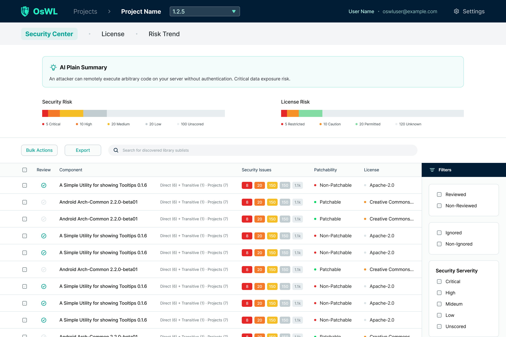
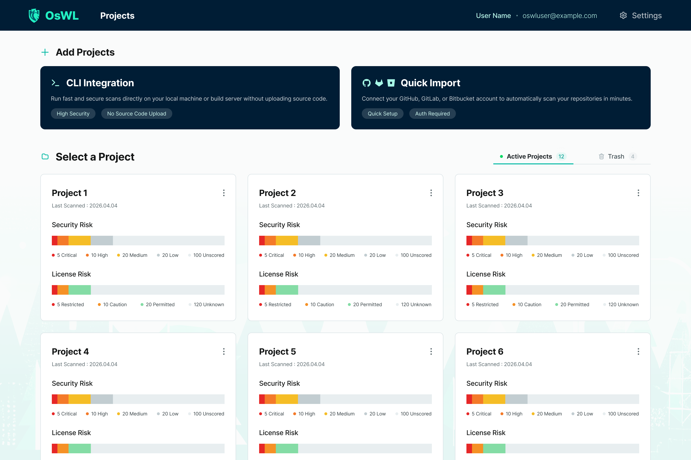
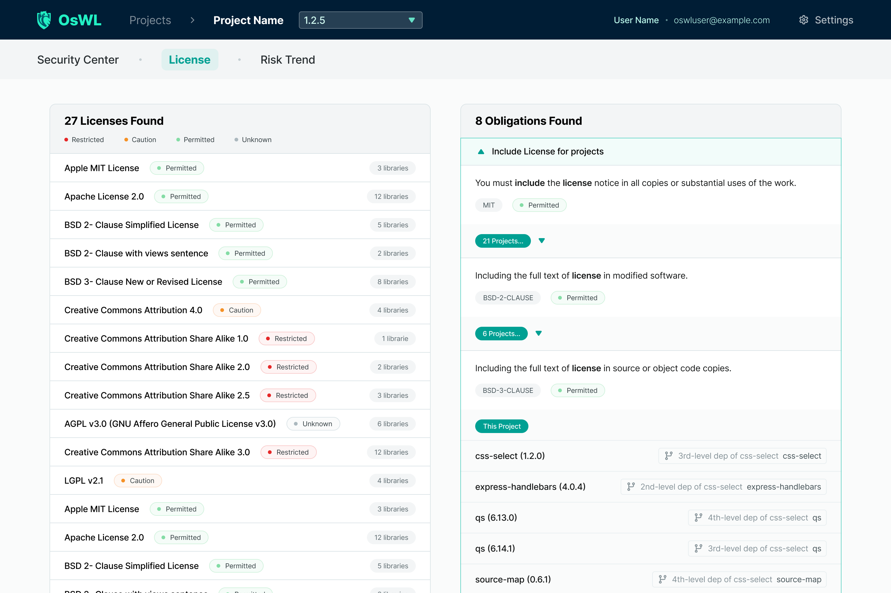
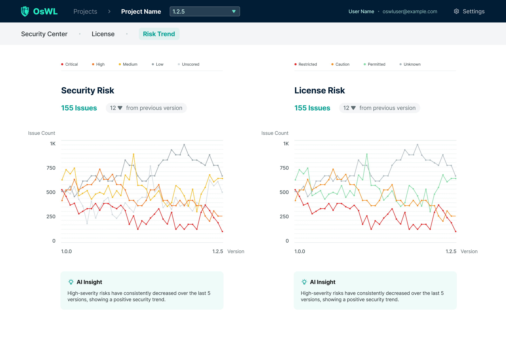

<div align="center">

# 🦉 OsWL

**Open-source Software Watchlist — SCA Platform**

Track CVE vulnerabilities and license risks across all your software components.

[](https://spring.io/projects/spring-boot)
[](https://openjdk.org/)
[](LICENSE)
[](https://github.com/SalkCoding/Oswl/actions/workflows/ci-cd.yml)
[](https://www.postgresql.org/)

**English** | [한국어](README.ko.md)

</div>

---

## What is OsWL?

**OsWL** (Open-source Software Watchlist) is an in-house **SCA (Software Composition Analysis)** platform that tracks and manages security vulnerabilities (CVEs) and license risks in OSS dependencies.

It provides a single dashboard for your entire software portfolio — connect your Git repositories for automatic import, or push scan results via the CLI, then immediately see CVSS-ranked vulnerability lists, license compliance status, risk trends over time, and AI-generated insights.

### Key Features

| Feature | Description |
|---|---|
| **Security Center** | Full CVE list with CVSS scores, severity ranking, and status management (Open / Suppressed / False Positive) |
| **License Analysis** | SPDX license detection per dependency with policy enforcement (Permitted / Caution / Restricted) |
| **Risk Trend** | Historical risk charts across up to 10 scans showing CVE count and license posture changes |
| **Version Diff** | Side-by-side comparison of two scan results — added, removed, and changed dependencies |
| **Quick Import** | One-click import from GitHub / GitLab / Bitbucket via VCS connection |
| **CLI Integration** | Language-agnostic scan submission via REST API with project-scoped API keys and CI machine tokens |
| **VCS Webhooks** | Auto re-scan on GitHub / GitLab / Bitbucket push events |
| **Scan Notifications** | Slack / Teams webhooks and email digest on Critical CVE or restricted licenses |
| **Team Management** | Per-project members via UI and `POST /api/projects/{id}/members` |
| **SBOM Export** | SPDX (tag-value + JSON) and CycloneDX from License Analysis |
| **AI Insights** | Optional LLM-generated risk summaries for CVE posture and license compliance |
| **Role-Based Access** | Role templates (Admin / Developer / Viewer) plus per-project membership |
| **Audit Logging** | Immutable audit log for all user and system events, with CSV export |
| **2FA / Trusted Devices** | Email OTP two-factor authentication with per-browser trusted-device support |

### Screenshots

| Security Center | Projects |
|:---:|:---:|
|  |  |

| License Analysis | Risk Trend |
|:---:|:---:|
|  |  |

Landing site: [salkcoding.github.io/Oswl](https://salkcoding.github.io/Oswl/) (deployed from `landing/` on `main`).

---

## Quick Start

### Prerequisites

| Tool | Version |
|---|---|
| JDK | 25+ |
| Gradle Wrapper | included (`./gradlew`) |
| PostgreSQL | 18+ (production) |
| (Optional) Docker | for running PostgreSQL locally |

### 1. Clone

```bash
git clone https://github.com/SalkCoding/Oswl.git
cd Oswl
```

### 2. Run locally (H2 file-mode)

```bash
./gradlew bootRun
# Application starts on http://localhost:8080
```

The `local` profile is active by default. It uses an embedded H2 database (`./oswl-db.mv.db`) — no external database required.

On first run the **Setup Wizard** opens automatically at `http://localhost:8080/setup`.  
Complete it to create the first System Admin account.

### 3. Run with PostgreSQL (production profile)

```bash
export SPRING_PROFILES_ACTIVE=prod
export DB_URL=jdbc:postgresql://localhost:5432/oswl
export DB_USERNAME=oswl
export DB_PASSWORD=your_password
export OSWL_ENCRYPTION_KEY=$(openssl rand -base64 32)

./gradlew bootRun
```

---

## Building

```bash
# Full build (all Gradle modules + Tailwind CSS)
./gradlew build

# Production JAR → oswl-app/build/libs/oswl-*.jar
./gradlew bootJar verifyProdJar

# Rebuild Tailwind CSS only
./gradlew buildTailwindCss

# Tests (all modules; excludes @Tag live)
./gradlew test
./gradlew testFast              # fast unit tests (CI PR gate)
./gradlew testParser            # parser verification

# Coverage report → oswl-app/build/reports/jacoco/test/html/index.html
./gradlew jacocoTestReport
```

> **Note:** The first build downloads the Tailwind CSS standalone CLI binary (~7 MB) to `oswl-app/build/tools/`. Subsequent builds use the cached binary.

### Gradle modules

| Module | Role |
|---|---|
| `oswl-app` | Spring Boot application (`bootJar`) |
| `oswl-scan-core` | Manifest parser, BOM resolver |
| `oswl-vuln-client` | OSV, deps.dev, EPSS, KEV clients |

---

## Configuration Reference

All settings are controlled via environment variables or `application.yaml` profiles.

| Variable | Default | Description |
|---|---|---|
| `SPRING_PROFILES_ACTIVE` | `local` | Active profile: `local` or `prod` |
| `OSWL_ENCRYPTION_KEY` | *(local dev only)* | Encryption key for stored secrets (VCS tokens). **Required in `prod`** — app will not start without it. Generate with `openssl rand -base64 32` |
| `DB_URL` | `jdbc:postgresql://localhost:5432/oswl` | PostgreSQL JDBC URL (prod profile) |
| `DB_USERNAME` | `oswl` | Database user (prod profile) |
| `DB_PASSWORD` | `oswl` | Database password (prod profile) |
| `OSWL_CLONE_TEMP_DIR` | system temp | Directory for temporary git clones during Quick Import |
| `OSWL_GITHUB_API_BASE` | `https://api.github.com` | GitHub API base URL (override for GHES) |
| `OSWL_RISK_TREND_LIMIT` | `10` | Maximum scans shown in the risk trend chart |
| `OSWL_AUDIT_MAX_PAGE_SIZE` | `200` | Maximum records per page in audit log API |
| `OSWL_AUDIT_RETENTION_MONTHS` | `6` | Months before audit log records are auto-deleted |

---

## Local Development Extras

### H2 Console

```
URL:  http://localhost:8080/h2-console
JDBC: jdbc:h2:file:./oswl-db
User: sa
Pass: (empty)
```

### OTP Email (local profile)

The `local` profile starts an embedded **GreenMail** SMTP server. No real email is sent.  
OTP codes appear in the server log:

```
*** OTP CODE: 123456 ***
```

### Seed Test Data

After logging in, call:

```
GET http://localhost:8080/data/test
```

This resets **all** existing data and populates the database with a rich set of sample projects, scans, CVEs, and licenses.

---

## Architecture Overview

```
Browser / CLI
     │
     ▼
oswl-app — Spring MVC Controllers  (thin — delegates to Service)
     │
     ▼
Service Layer           (business logic, transactions)
     │
   ┌─┴──────────────────┬────────────────────┐
   ▼                    ▼                    ▼
JPA Repositories    oswl-scan-core      oswl-vuln-client
(PostgreSQL / H2)   (manifest parser)   (OSV · EPSS · KEV · deps.dev)
                         │
                    VCS clients in oswl-app (GitHub, GitLab, Bitbucket)
```

**Core domain model:**

```
Project
 └── ProjectVersion (per branch)
 └── ScanResult     (per CLI / Quick Import scan)
      └── ScanComponent
           └── DependencyPath

Library  (shared across projects — group:artifact@version)
 └── Cve
 └── LicensePolicyEntry
```

---

## API Documentation

Interactive Swagger UI is available in the **`local` profile** at `http://localhost:8080/swagger-ui.html`. It is **disabled in `prod`**.

---

## Documentation

Full documentation is available in the [`docs/`](docs/) folder and on the [GitHub Wiki](https://github.com/SalkCoding/Oswl/wiki) (English `docs/` auto-synced on push to `main`). Korean docs: [`docs/ko/`](docs/ko/) (repository only).

Contributions are welcome — see [CONTRIBUTING.md](CONTRIBUTING.md).

| Page | Description |
|---|---|
| [Home](docs/Home.md) | Platform overview and navigation guide |
| [Getting Started](docs/Getting-Started.md) | Installation, setup wizard, first project |
| [User Guide](docs/User-Guide.md) | Day-to-day usage of the dashboard |
| [Quick Import](docs/Quick-Import.md) | Importing projects from GitHub / GitLab / Bitbucket |
| [CLI Integration](docs/CLI-Integration.md) | Submitting scans from build pipelines |
| [Security Center](docs/Security-Center.md) | Managing vulnerabilities (CVEs) |
| [License Analysis](docs/License-Analysis.md) | License compliance and policy management |
| [Risk Trend](docs/Risk-Trend.md) | Interpreting historical risk charts |
| [Version Diff](docs/Version-Diff.md) | Comparing two scan results |
| [Administration](docs/Administration.md) | Users, roles, audit logs, security settings |
| [Authorization layers](docs/Authorization-Layers.md) | Role templates vs project membership |
| [Production deployment](docs/Production-Deployment-Checklist.md) | Production checklist |
| [Database schema](docs/Database-Schema.md) | Flyway, `ddl-auto`, and SQL migrations |
| [Scan API security](docs/Scan-Api-Security.md) | CLI scan auth and audit logging |
| [API Reference](docs/API-Reference.md) | REST API endpoint summary |
| [Glossary](docs/Glossary.md) | Terms and definitions |

---

## Authors

OsWL is developed and maintained by **[SalkCoding](https://github.com/SalkCoding)**.

| Author | Role | GitHub |
|---|---|---|
| SalkCoding | Project lead & primary maintainer | [@SalkCoding](https://github.com/SalkCoding) |
| Tengball | Design & UI/UX | [@Tengball](https://github.com/Tengball) |

Questions, feedback, or collaboration inquiries are welcome via [GitHub Issues](https://github.com/SalkCoding/Oswl/issues).

---

## License

This project is licensed under the [MIT License](LICENSE).
